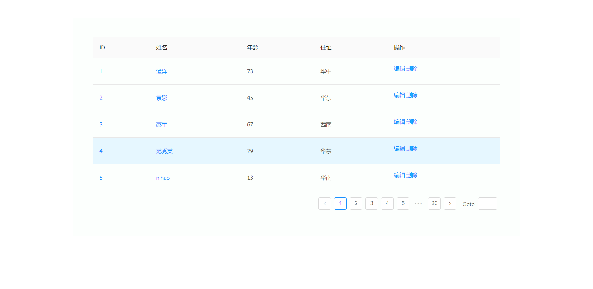

# React-dva-CRUD_Demo

 

> Project mainly focused on how to use dva to create you application for fresh guys. HoooHa!

### Skills Stack

* `React + dva + antd + roadhog` (**data from roadhog-mock**)

### Process

* Using `dva-cli` to create the structure of demo **DONE**
* Using `antd` to design pages **DONE**
* Using `roadhog-mock` to produce mockdata for demo's request **DONE**

    * request all user data from `roadhog-mock` **DONE**
    * edit user info **DONE**
    * delete user info **DONE**
    * add a user **UNDONE**

### License

MIT